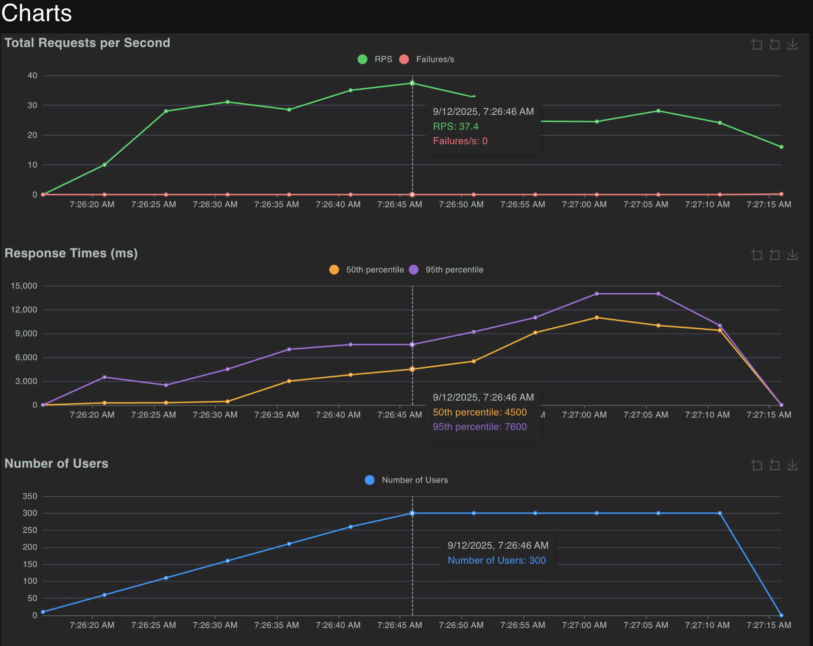
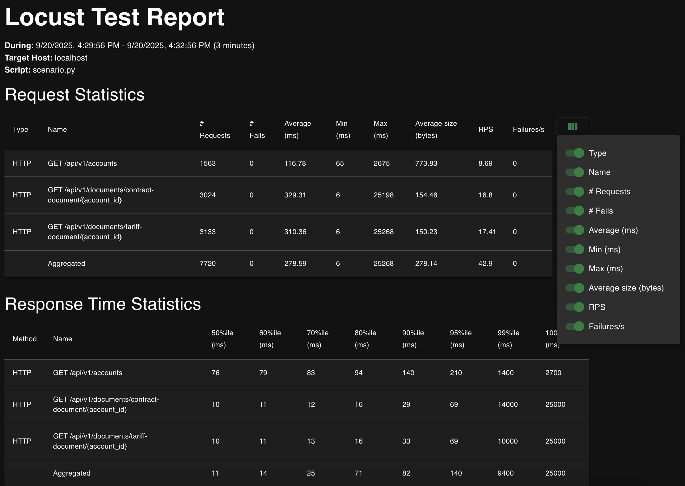
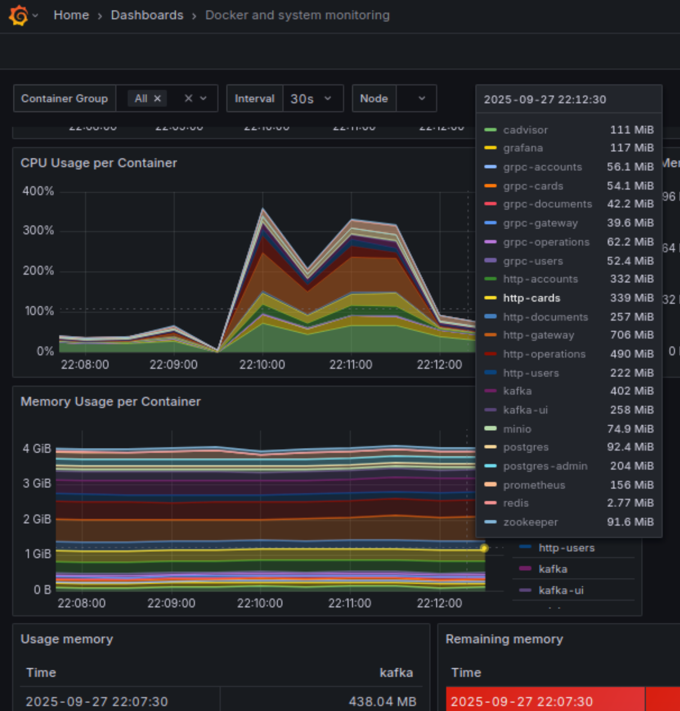
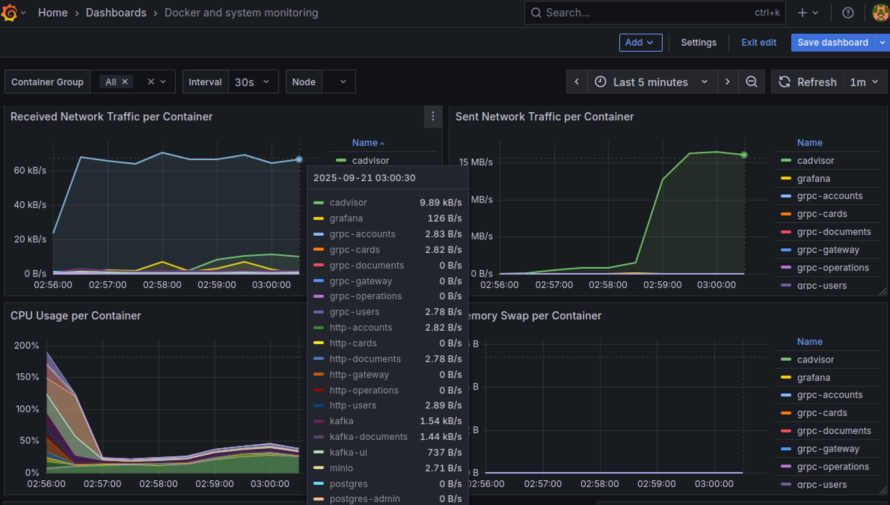

# Performance Tests

This project implements performance tests for
the [Performance QA Engineer Course](https://github.com/Nikita-Filonov/performance-qa-engineer-course) stand — a
full-featured educational banking system designed for testing and performance validation in training environments. The
platform provides a simulation of real-world scenarios and utilizes `Kafka`, `Redis`, `PostgreSQL`, `MinIO`, `Grafana`, and `Prometheus` 
for data handling, storage, and monitoring. Its API is exposed via both HTTP and gRPC protocols.

**Technologies used**:

- `Python`
- `Locust`
- `Pydantic`
- `gRPC` / `grpcio`
- `HTTP` / `HTTPX`
- `Docker`
- `Kafka`
- `Redis`
- `PostgreSQL`
- `MinIO`
- `Grafana`
- `Prometheus`

Test scenarios are written using **Python** and **Locust** as a specific tool for performance testing. 
They reflect realistic business flows encompassing multiple services' integrations and provide visibility into
system performance under load.

Following industry-standard best practices this project provides:
- Flexibility for supporting both HTTP and gRPC services testing.
- API clients, designed to be reusable, interchangeable and injectable.
- The framework, easy to extend with new scenarios or client implementations as the system evolves.


---

## Table of Contents

- [Project Overview](#project-overview)
- [Executing Tests](#executing-tests)
- [Monitoring & Observability](#monitoring--observability)
- [CI/CD](#cicd)

---

## Project Overview

**Key framework components:**

- **Scenarios**: Tests with steps representing typical user journeys.
- **API Clients**: To provide communication with HTTP/gRPC services.
- **Seeding**: Automated test data generation scenarios, making use of Locust event hooks.
- **Reporting**: Locust Built-in HTML reports; Prometheus and Grafana metrics provided along with the course test
  stand.

Business scenarios covered:

- Existing user: 
    - make purchase
    - get documents
    - issue virtual card
    - view operations
- New user: 
    - create account
    - top up card
    - issue physical card
    - get account list and documents

---


## Executing Tests

1. Clone the Repository

```bash
git clone https://github.com/alzuewa/performance-tests.git
cd performance-tests
```

2. Create a Virtual Environment

#### Linux / MacOS

```bash
python3 -m venv venv
source venv/bin/activate
```

#### Windows

```bash
python -m venv venv
venv\Scripts\activate
```

3. Install Dependencies

```bash
pip install -r requirements.txt
```

---

4. Run Performance Tests

Each scenario is placed in a separate directory with a configuration file. The execution report will be automatically generated and saved in the directory.

Example:

```bash
locust --config=./scenarios/http/gateway/existing_user_get_documents/v1.0.conf
```

Open the HTML report with execution statistics and metrics: `./scenarios/http/gateway/existing_user_get_documents/report.html`

<div style="display: flex;">
    <div style="margin: 5px; width: 50%;">
        
    </div>
    <div style="margin: 5px; width: 50%;">
        
    </div>
</div>

---

## Monitoring & Observability

In addition to Locust reports, there are system-level metrics available:

- **Grafana:** http://localhost:3002
- **Prometheus:** http://localhost:9090

<div style="display: flex;">
    <div style="margin: 5px; width: 50%;">
        
    </div>
    <div style="margin: 5px; width: 50%;">
        
    </div>
</div>

These dashboards are preconfigured in
the [course infrastructure repository](https://github.com/Nikita-Filonov/performance-qa-engineer-course).

---

## CI/CD

> [!NOTE] 
> Tests may be executed with GitHub Actions integration. Run the scenarios in headless mode and publish reports
to GitHub Pages automatically.
> 
> The configuration can be found here: [.github/workflows/performance-tests.yml](./.github/workflows/performance-tests.yaml).